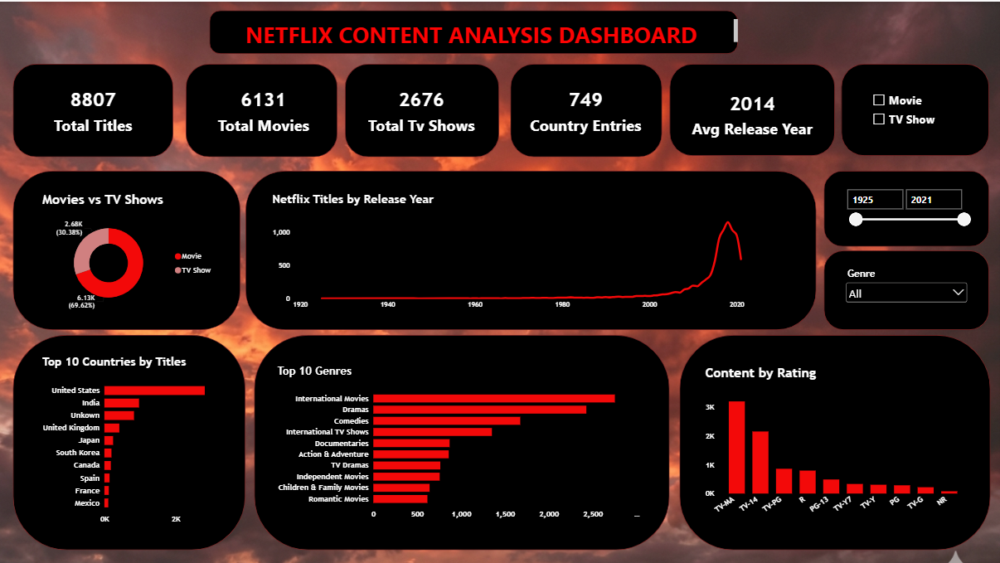

# 🎬 Netflix Movies & TV Shows Analysis

## 📌 Project Overview

This project was completed as part of the **AnalystLab Africa Data Analytics Internship – Week 2**.

The project focuses on analyzing the **Netflix Movies and TV Shows dataset** to understand the composition and distribution of Netflix's content library.

The workflow covered **data cleaning, exploratory data analysis (EDA), data visualization, and interactive dashboard development** using Python and Power BI.

---

## 🎯 Project Objectives

The main objectives of this project were to:

* Clean and prepare the Netflix dataset for analysis.
* Explore the structure and characteristics of the dataset.
* Compare Movies and TV Shows available on Netflix.
* Analyze content distribution across release years.
* Identify the most common genres.
* Examine content ratings.
* Analyze the geographic distribution of Netflix content.
* Create meaningful visualizations from the cleaned data.
* Develop an interactive Power BI dashboard to communicate key insights.

---

## 📊 Dataset

The dataset used for this project is the **Netflix Movies and TV Shows dataset**.

### Dataset Dimensions

* **Rows:** 8,807
* **Columns:** 12

### Columns

| Column         | Description                                       |
| -------------- | ------------------------------------------------- |
| `show_id`      | Unique identifier for each title                  |
| `type`         | Indicates whether the title is a Movie or TV Show |
| `title`        | Name of the title                                 |
| `director`     | Director of the title                             |
| `cast`         | Main cast members                                 |
| `country`      | Country or countries associated with the title    |
| `date_added`   | Date the title was added to Netflix               |
| `release_year` | Original release year                             |
| `rating`       | Content rating                                    |
| `duration`     | Movie duration or number of TV Show seasons       |
| `listed_in`    | Genres and categories                             |
| `description`  | Description of the title                          |

---

## 🧹 Data Cleaning

The dataset was first inspected to understand its structure, data types, and missing values.

The cleaning process included:

* Checking the dataset dimensions.
* Inspecting column data types.
* Identifying missing values.
* Investigating missing values in important columns.
* Cleaning the `date_added` field.
* Correcting issues with the `release_year` field.
* Checking the `rating` and `duration` fields.
* Preparing the dataset for exploratory analysis and visualization.
* Saving the cleaned dataset as a CSV file.

### Missing Values Identified

Some columns contained missing information, particularly:

* `director`
* `cast`
* `country`
* `date_added`
* `rating`
* `duration`

These missing values were investigated and handled appropriately during the cleaning process.

### Final Dataset

After the cleaning process, the final dataset contained:

**8,807 rows × 12 columns**

---

## 🔎 Exploratory Data Analysis

The cleaned dataset was explored using Python to identify patterns and trends within Netflix's content library.

### 🎥 Movies vs TV Shows

The dataset contains:

* **Movies:** 6,131
* **TV Shows:** 2,676

Movies therefore make up the larger proportion of titles in the dataset.

### 📅 Release Years

The `release_year` column was analyzed to understand how Netflix content is distributed across different years.

The analysis showed that the catalog contains titles ranging from older releases to more recent content, with a strong concentration of titles from recent years.

### 🎭 Genres

The `listed_in` column was analyzed to identify the most common genres and categories.

Some of the most prominent categories include:

* International Movies
* Dramas
* Comedies
* International TV Shows
* Documentaries

### ⭐ Ratings

Netflix titles were also analyzed based on their content ratings to understand the types of content available across different audience classifications.

### 🌍 Countries

The geographic distribution of Netflix titles was explored to understand the countries contributing content to the platform.

---

## 📈 Power BI Dashboard

The cleaned Netflix dataset was imported into **Microsoft Power BI** to create an interactive dashboard.

The dashboard provides a visual overview of Netflix's content library and allows users to explore the data using interactive filters.

### Dashboard Features

The dashboard includes:

* KPI cards
* Netflix content by type
* Content trends by release year
* Top 10 genres
* Rating analysis
* Country analysis
* Interactive slicers

### Interactive Filters

The dashboard includes slicers that allow users to filter the analysis by:

* **Year**
* **Rating**
* **Country**
* **Type**

### Dashboard Preview

---

## 💡 Key Insights

The analysis produced several important insights:

1. **Movies dominate the Netflix catalog**, with 6,131 Movies compared with 2,676 TV Shows.

2. **Netflix has a diverse content library**, covering many genres and categories.

3. **International content represents a significant part of the catalog**, demonstrating Netflix's global content strategy.

4. **Dramas, international movies, and comedies** are among the most prominent content categories.

5. **The catalog is strongly concentrated around recent release years**, indicating a substantial focus on newer content.

6. **Netflix content spans many countries and rating categories**, highlighting the diversity of its global library.

---

## 🛠️ Tools & Technologies

### Python

Used for data cleaning and exploratory data analysis.

* Pandas
* NumPy
* Matplotlib
* Seaborn

### Jupyter Notebook

Used to document the data cleaning and EDA workflow.

### Power BI

Used to create the interactive dashboard and communicate insights visually.

### GitHub

Used for project versioning, documentation, and portfolio presentation.

---

## 📁 Project Files

| File                                   | Description                                                            |
| -------------------------------------- | ---------------------------------------------------------------------- |
| `Project2_NetflixTitles_Cleaned.ipynb` | Jupyter Notebook containing the data cleaning and exploratory analysis |
| `NetflixTitles_Cleaned.csv`            | Cleaned Netflix dataset                                                |
| `Netflix_Dashboard.pbix`               | Interactive Power BI dashboard                                         |
| `Netflix_Dashboard.png`                | Screenshot/preview of the Power BI dashboard                           |
| `README.md`                            | Project documentation                                                  |

---

## 📚 Skills Demonstrated

This project demonstrates practical experience in:

* Data Cleaning
* Data Preparation
* Exploratory Data Analysis
* Data Visualization
* Python for Data Analysis
* Pandas
* Matplotlib
* Seaborn
* Power BI
* Dashboard Development
* Data Storytelling
* GitHub Project Documentation

---

## 🎓 AnalystLab Africa Internship

**Program:** AnalystLab Africa Data Analytics Internship
**Week:** 2
**Project:** Netflix Movies & TV Shows Analysis

This project forms part of my ongoing data analytics internship journey, where I am developing practical skills in **data cleaning, exploratory analysis, visualization, dashboard development, and communicating data-driven insights**.

